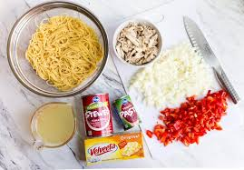

Food recipie 
this is the recipie of spicy spaghatti  and the ingeridients of this recepie are mentioned 
spaghatties,water,salt to boil the spaghattie and the ingeridients of sauce are
chili sauce and other sauces and chicken and vegetables and the rest of ingeridients are mentioned in the card of website
so iuse html and css

Here's the README for your food recipe card HTML code:

Food Recipe Card - HTML Code
Overview
This HTML code creates a simple recipe card designed for a blog post. It contains two main sections: a description of the recipe on the left and an image on the right. The card presents the recipe's author, the name of the recipe, a brief description, a list of ingredients, and cooking instructions.

File Structure
index.html: This is the main HTML file that contains the structure of the recipe card.
style.css: This is the CSS file linked in the HTML that will define the styles and layout for the recipe card.
images.jpeg: This is the image file that is displayed on the recipe card. The image is loaded in the second column of the card.
HTML Structure
1. <head> Section:
Metadata: The meta tags set up character encoding, compatibility mode, and viewport settings.
Title: The title of the webpage is set to "food recipe card for blogpost".
Stylesheet Link: A link to the external CSS file style.css is provided to style the recipe card.
2. <body> Section:
Card Container (
): This is the main container that wraps the entire recipe card.
Column 1 (
): The first column that holds the text content.
Recipe Number (
): Displays the number "1", indicating the first recipe.
Author (
): Displays the author's name, "Mariam Fatima".
Recipe Name (
): Displays the name of the recipe, "Spicy Spaghetti Recipe".
Description (
): Provides a brief overview of the recipe, ingredients list, and cooking instructions.
Read More Line (
): A line indicating that more details are available, with a clickable "Read more" option.
Additional Element (
): Placeholder or decorative element represented by "c".
Column 2 (
): The second column that contains the recipe image.
Image (): Displays an image of the recipe.
Instructions for Use
Include the HTML and CSS Files: Make sure to include both index.html and style.css in the same directory, along with the images.jpeg image file.
Customization: You can modify the text content, change the image source, or update the CSS file to change the appearance of the recipe card according to your needs.
Example Screenshot
If you want to see how this code renders visually, you can load the index.html file in your browser. The card should display the recipe information neatly, with an image to the right.

